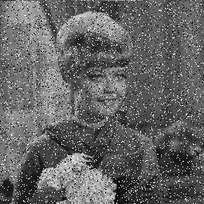

# Readme

刘暢: 19309088  

吴甜裕: 18307060

## 自适应的中值滤波器

### 简介

* 属于自适应滤波器, 参数为滤波模板的大小和滤波器模板最大值
* 主要用来处理脉冲噪声, 尽量保持非脉冲噪声细节
* 对模板内的像素点排序后求中间值, 用该值代替原本的值(此处直接使用了最简单粗暴的全部冒泡排序取中值)
* 一般用来对椒盐噪声进行滤波

### 结果

* 实现的函数 `void mid_filter(Mat &src, Mat &dst, int kernel_size)`
  * 参数是输入输出图片以及中值滤波的核的大小

* 效果对比

| 原图                         | 自编函数的结果                | OpenCV函数结果                      |
| ---------------------------- | ----------------------------- | ----------------------------------- |
|  |   |   |
|  |  |  |
