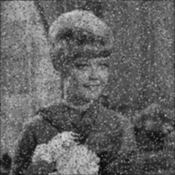
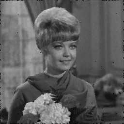
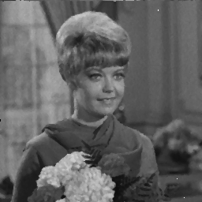

# Readme

刘暢: 19309088  

吴甜裕: 18307060

## 低通高斯滤波器

### 简介
* 属于空间滤波器, 参数为滤波器模板大小和高斯函数的方差
* 用生成的滤波器模板对图像进行卷积计算, 边缘处直接补零处理

### 结果

* 实现的函数 `lp_gauss_filter(Mat &src, Mat &dst, int kernel_size, double sigma)`
  * 参数为输入输出图片, 卷积核大小以及高斯函数的方差

* 效果对比

| 原图                         | 自编函数的结果                    | OpenCV函数结果                          |
| ---------------------------- | --------------------------------- | --------------------------------------- |
|  |   |   |
|  |  |  |

## 中值滤波器

### 简介

* 属于排序滤波器, 参数为滤波模板的大小
* 对模板内的像素点排序后求中间值, 用该值代替原本的值(此处直接使用了最简单粗暴的全部冒泡排序取中值)
* 一般用来对椒盐噪声进行滤波

### 结果

* 实现的函数 `void mid_filter(Mat &src, Mat &dst, int kernel_size)`
  * 参数是输入输出图片以及中值滤波的核的大小

* 效果对比

| 原图                         | 自编函数的结果                | OpenCV函数结果                      |
| ---------------------------- | ----------------------------- | ----------------------------------- |
|  |   |   |
|  |  |  |
