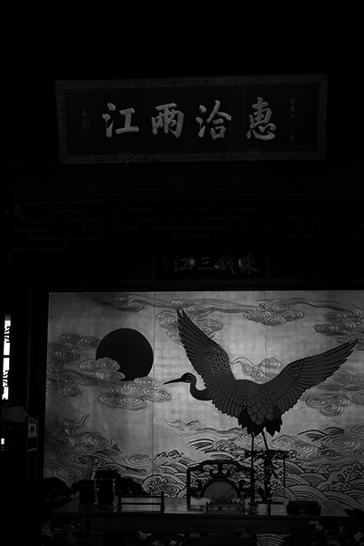

# Readme

刘暢: 19309088  

吴甜裕: 18307060

## 原理简介

灰度直方图均衡, 常用在图像增强中增大图像的对比度, 扩大灰度分布范围, 映射过程中像素点的求法为

$
s_k = \sum\limits_{j=0}^{j < k} P_r(j) = \sum\limits_{j=0}^{j < k} \frac{n_j}{n}
$

实现过程大致可以分为

* 统计每个灰度级像素点个数$n_j$
* 计算比例$P_j$
* 重新计算映射后灰度值$s_k$
* 更新灰度值

## 结果

* 实现函数

* 效果对比

| 原图            | 自编函数的结果                |
| --------------- | ----------------------------- |
|  |  |
|   |   |