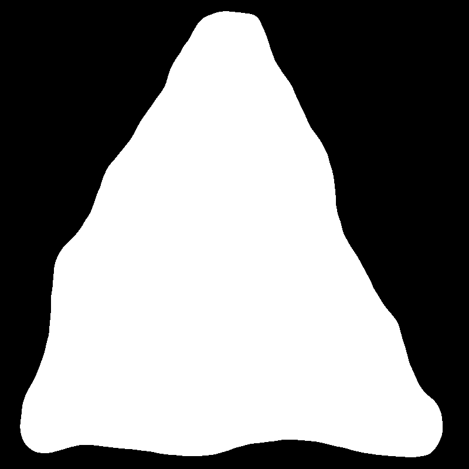
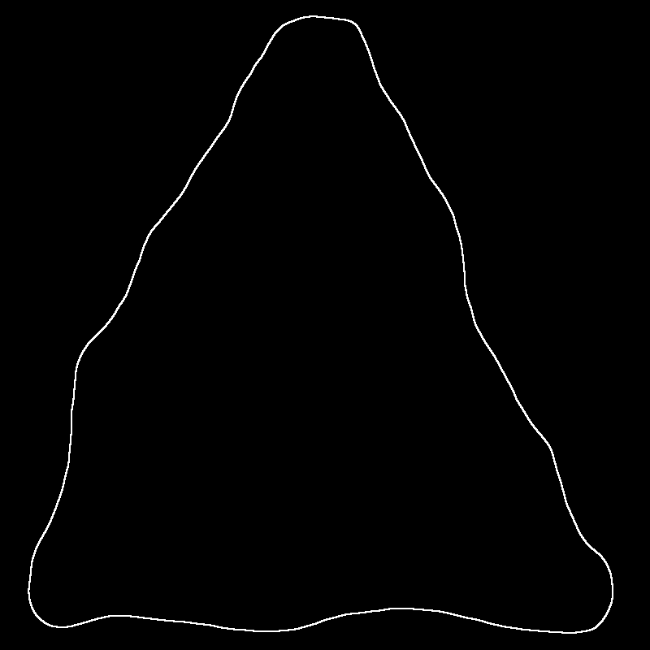
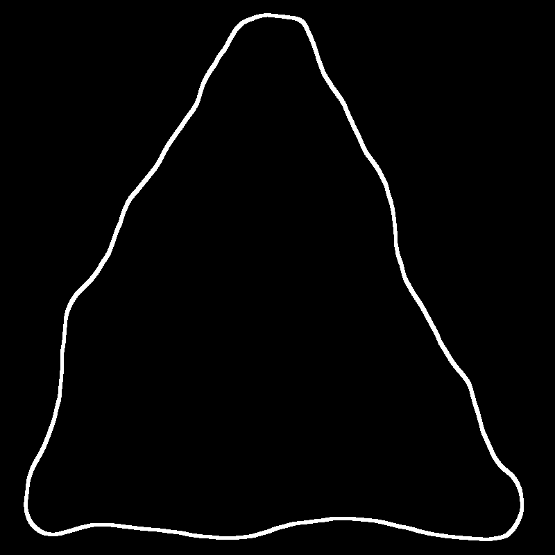
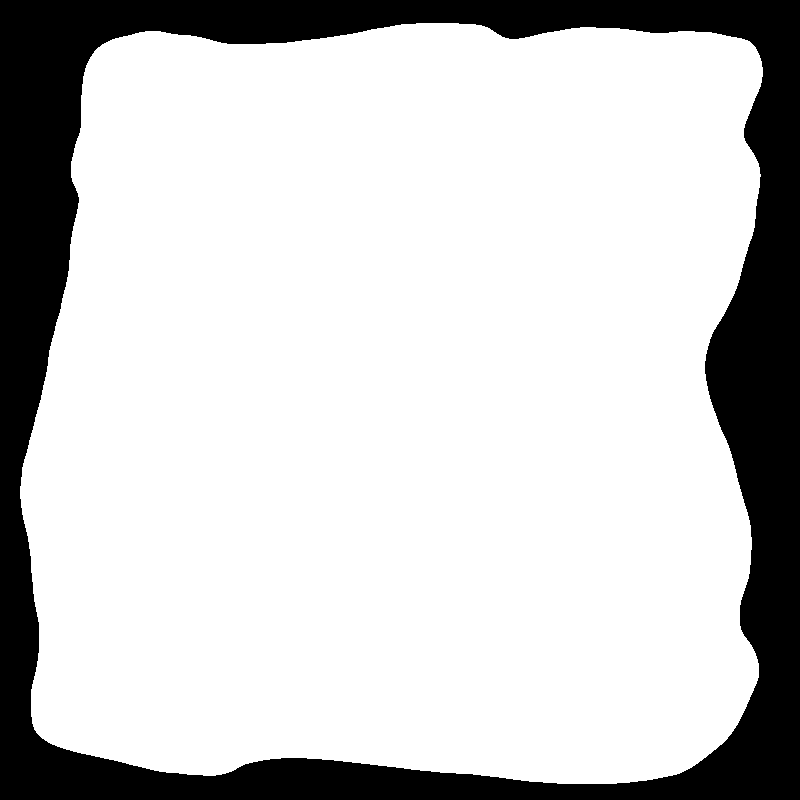
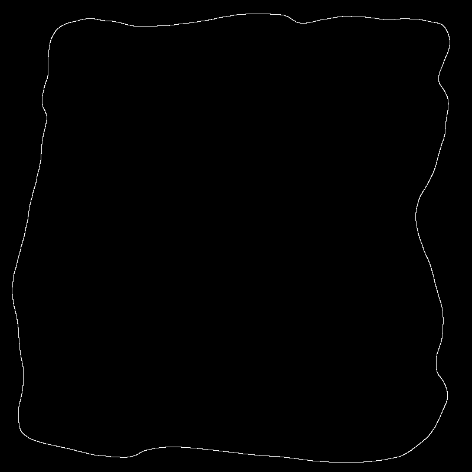
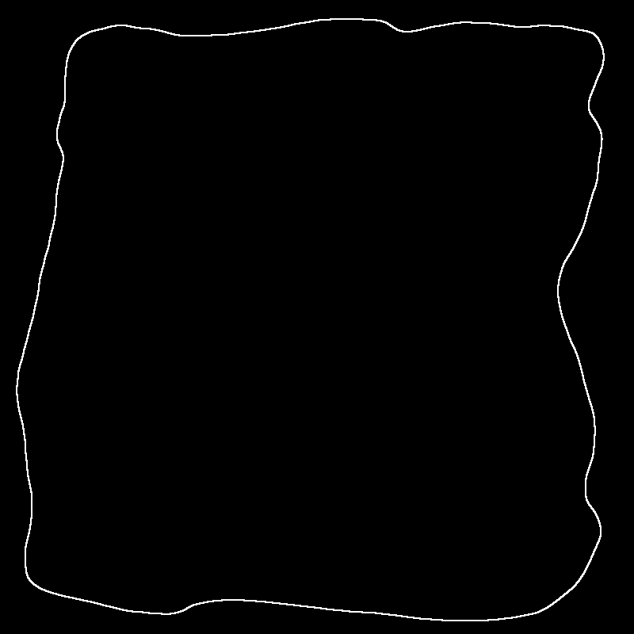
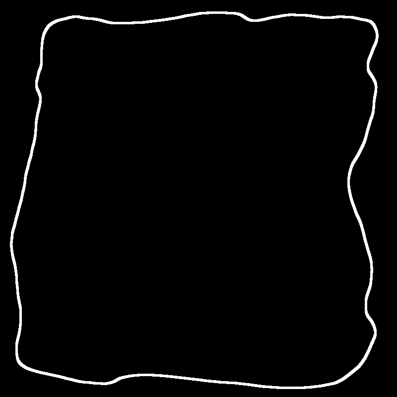

# Readme

刘暢: 19309088  

吴甜裕: 18307060

## 原理简介

使用形态学方法进行边缘提取

形态学常用的操作有膨胀腐蚀, 开闭操作

其中

* 对于二值图像腐蚀操作为: 对B进行平移后所有满足(A $ \& $ B = 1)的值
* 对于灰度图像腐蚀操作为: 对指定的kernel_size下覆盖的范围取最小值

对前景像素集合A提取边界实现过程大致可以分为

* 使用结构元B腐蚀A
* 求A和B腐蚀结果的差集

其中提取边界的宽度和效果和使用的结构元有关, 因此使用的函数的参数为结构元B的宽度, 默认使用的结构元B为正方形

除此之外, 由于本次给出的图片是的像素宽度为1, 因此在读取时需要注意将一次读入的一比特数据的每一位分别赋给8个数据点. 同时由于创建的保存矩阵默认的类型是以8位像素模式保存的, 因此为了方便展示的效果, 需要将原本为1的二值扩展为255

## 实现函数

* `edge_detect(Mat &src, Mat &dst, int kernel_size)`
  * 其中`kernel_size`为输入的结构元的大小
## 结果
* 效果对比

| 原图                               | 自编函数的结果                | 结构元宽度 |
| ---------------------------------- | ----------------------------- | ---------- |
|  |  | 3          |
|  |  | 5          |
|  |  | 11         |
|    |   | 3          |
|    |  | 5          |
|    |  | 11         |
