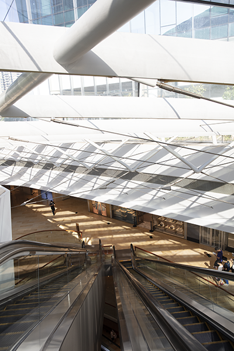
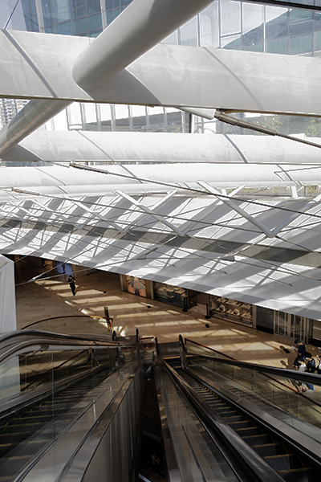
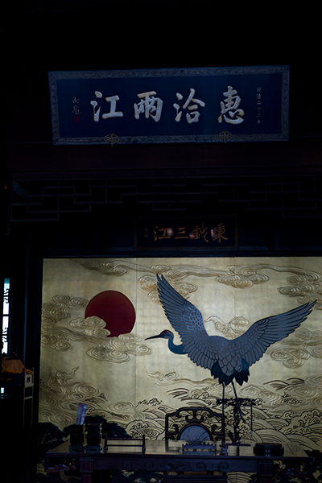
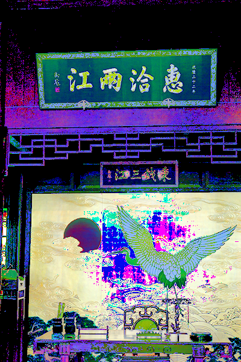

# Readme

刘暢: 19309088  

吴甜裕: 18307060

## 原理简介

彩图的灰度直方图均衡

$
s_k = \sum\limits_{j=0}^{j < k} P_r(j) = \sum\limits_{j=0}^{j < k} \frac{n_j}{n}
$

实现过程大致可以分为

* 将`RGB`模型的图像转化到`HSI`模型的图像上
* 使用灰度直方图均衡法对转化得到的`I`通道进行计算
* 根据新得到的`HSI`模型的`I`值, 得到新的均衡后的RGB图像

## 结果
* 效果对比

| 原图           | 自编函数的结果                |
| -------------- | ----------------------------- |
|   |  |
|  |   |