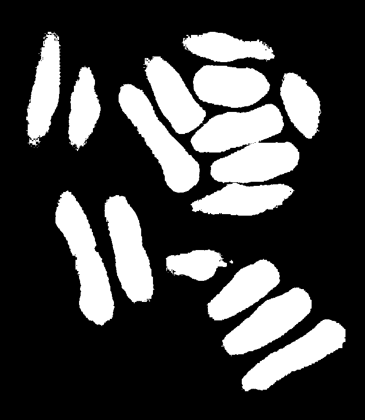
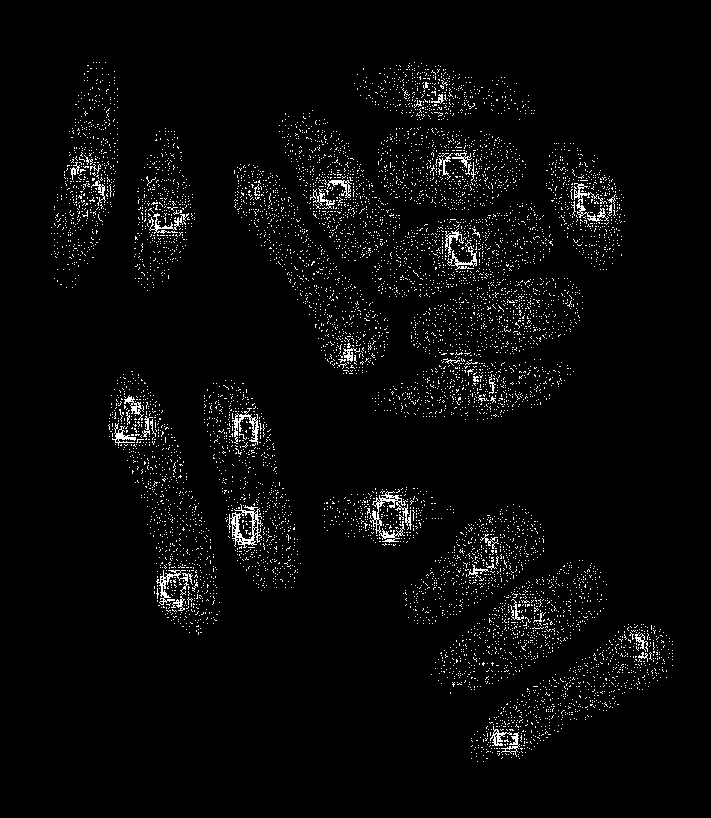
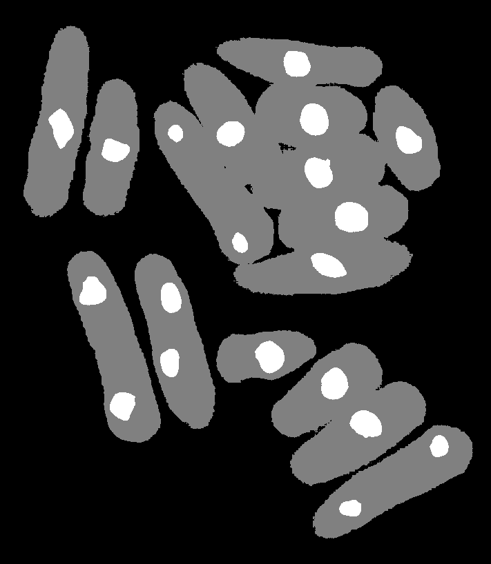

# Readme

刘暢: 19309088  

吴甜裕: 18307060

## 原理简介

阈值分割的基本原理是根据图像不同区域灰度的分布将其分为不同的部分, 根据使用的阈值来源, 可以将其分为全局阈值处理和局部阈值处理, 其中全局阈值处理的主要的方法可以分为

* 基本全局阈值处理: 适用于图像灰度直方图分布具有很深的波谷, 缺点是对于灰度直方图分布比较几种或者波峰不明显时效果较差
* Otsu方法的全局最优: 通过最大化类间方差对不同的类进行分割, 相对分割的性能较好
* 基于平滑的全局阈值方法: 首先对图像进行预处理滤除某些干扰因素, 减少噪声, 并对直方图进行压缩, 但是对于较小物体的分割效果不佳
* 基于边缘信息的全局阈值方法: 通过提取图中的边缘信息, 减少背景信息对灰度直方图的影响, 筛选出前景中更适合用来分类的部分

## 实现内容

在本次作业中分别实现最基本的基于 ***Osu的全局阈值分割***, 并尝试在实现最基本的版本后循序渐进的实现基于边缘信息的全局阈值方法, 尝试取得更好的分割性能

### Osu的全局阈值分割

实现过程大致可以分为

* 计算图像的归一化直方图
  * 统计每个灰度级像素点个数$n_j$
  * 计算比例$p_j$
* 计算每个像素点出现的累计概率和$P_j$
* 计算全局灰度均值$m_G$和全局方差$\sigma_G$
* 计算不同的分类线时对应的分类的灰度均值$m_k$和类间方差$\sigma_k$, $k = 1\ to\ L - 1$
  * $\sigma_k^2 = \frac{(m_GP_k \ - m_k)^2}{P_k \ (1 - P_k)}$
* 挑选出最大的$\sigma_k$, 当k为该取值时说明类间方差最大, 此时分类最为合理, 可以计算测度$\eta = \frac{\sigma_k^2}{\sigma_m^2}$来判断其性能
* 以该k值为分界线对图像进行全局阈值处理

### 基于边缘信息的全局阈值分割

相较于简单的使用Osu方法进行阈值分割, 该方法预先提取图像的边缘, 根据边缘图像规定一个阈值对图像说先进行第一次阈值分割得到一张掩膜, 对原始图像进行处理后再对处理后的图像进行阈值分割

具体的实现流程为

* 使用梯度算子或者拉普拉斯算子计算原图的梯度或拉普拉斯绝对值
* 根据规定的阈值, 对求得的绝对值图片二值化, 得到一个只包含强阈值的掩膜图像
* 使用得到的掩膜图像对原图进行处理, 也即只有掩膜图像中不为零的点才参与运算
* 对处理后的图像做Osu阈值处理

基于上述处理过程得到的图像均集中在较大的图像附近, 得到的测度更高, 提取结果更好, 提取到的形状取决于阈值的大小

### 基于双阈值的全局分割

与基于但阈值的Osu全局分割原理类似, 基于多个阈值的分割的目标也是使得所有类间方差的距离和达到最大, 也即对所有可能的取值遍历, 找到使得距离和的最大值. 但是由于计算复杂性成指数级增长, 因此一般而言, 常常用这种逐步遍历的方法来处理双阈值问题. 

具体的实现流程为

* 计算图像的统计值, 例如所有灰度级的概率分布, 平局灰度和方差等值
* $for \ k1 = 1 \ to \ L \ - \ 3, \ k2 = \ k1 \ to \ L -2$, 在这个二重循环中依次计算每对$(k1, k2)$对应的类间方差的和, 最终比较得到最大值
  * $\sigma_{k1, k2}^2 = P_1(m_1 - m_G)^2 + P_2(m_2 - m_G)^2 + P_3(m_3 - m_G)^2$
* 根据求得的两个类的分界线, 将图像进行阈值处理为三种灰度值

## 结果

* 实现函数

* 效果对比

| 原图                 | Osu全局阈值分割的结果       | 基于边缘信息的Osu全局阈值分割的结果           | 双阈值分割的结果                         |
| -------------------- | --------------------------- | --------------------------------------------- | ---------------------------------------- |
|  |  |         |                |
| 分割边界, $\eta$     | $ k = 51, \ \eta = 0.69 $   | $ lapalace \ k = 13 ,\ k = 62, \ \eta = 0.83$ | $ k_1 = 35, \ k_2 = 102 ,\ \eta = 0.87 $ |